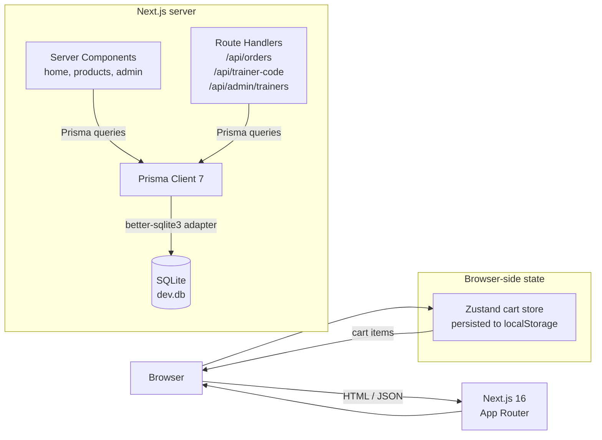
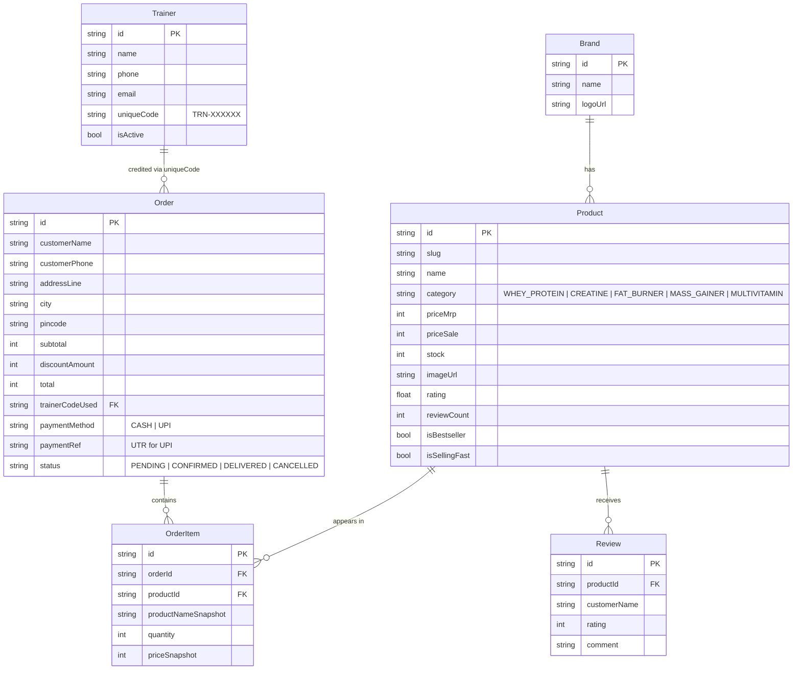

# Marketplace Fitness

A trainer-curated supplement e-commerce site for gym-goers in **Indore**. Built so a working gym trainer can sell authentic supplements they actually use, give clients a personal discount via a unique trainer code, and track which trainer drove which sale from a simple admin panel.

Built with **Next.js 16**, **TypeScript**, **Tailwind CSS v4**, **Prisma 7 (SQLite)**, and **Zustand**.

---

## Table of contents

1. [Features](#features)
2. [URL reference](#url-reference)
3. [Architecture](#architecture)
4. [Data model](#data-model)
5. [Tech stack](#tech-stack)
6. [Project structure](#project-structure)
7. [Local development](#local-development)
8. [npm scripts](#npm-scripts)
9. [Sample data and trainer codes](#sample-data-and-trainer-codes)
10. [Security notes](#security-notes)

---

## Features

**Storefront**
- Home page with hero, 5 category tiles, and a bestsellers grid
- About Us page (the trainer's story)
- Product browsing at `/products` with sidebar filters (5 categories, brand, price range, rating, bestseller, "selling fast") and sort (popularity, price asc/desc, rating)
- Per-category landing pages
- Product detail pages with stock state, key specs, and reviews
- "Bestseller" and "Selling Fast" badges on cards and detail
- Cart with Zustand state, persisted to `localStorage`, stock-capped quantities

**Checkout**
- Address form with strict validation (Indian 10-digit mobile, 6-digit pincode)
- Trainer discount code field with live validation. A valid `TRN-XXXXXX` code applies a **10% discount** automatically. Invalid codes are silently ignored so a typo never blocks an order.
- Two payment methods: **Cash on Delivery** and **UPI** (UPI shows a placeholder QR and requires a UTR / transaction reference before the order is accepted)
- Atomic order creation with stock decrement inside a Prisma transaction

**Admin (no authentication, development only)**
- Dashboard with total revenue, order count, top trainer, top product
- Product list (read-only view of catalog and live stock)
- Trainer list with one-click "Add Trainer" form (auto-generates a unique `TRN-XXXXXX` code)
- All orders, with payment method, trainer, status, and total
- **Sales by trainer** report — the key reason this app exists. Per-trainer breakdown of orders, units sold, revenue, and top product, filterable by date range, with CSV export.

---

## URL reference

The dev server runs on `http://localhost:3000`. All paths below are relative to that.

### Public storefront

| URL | Purpose |
|---|---|
| `/` | Home (hero, categories, bestsellers) |
| `/about` | About Us |
| `/products` | All products with filter sidebar (5 categories, brand, price, rating, etc.) |
| `/products/category/whey-protein` | Whey Protein category |
| `/products/category/creatine` | Creatine category |
| `/products/category/fat-burner` | Fat Burner category |
| `/products/category/mass-gainer` | Mass Gainer category |
| `/products/category/multivitamin` | Multivitamin category |
| `/products/[slug]` | Product detail (e.g. `/products/muscleblaze-biozyme-performance-whey-1kg-rich-chocolate`) |
| `/cart` | Cart |
| `/checkout` | Checkout (address, trainer code, payment) |
| `/order/success/[id]` | Post-order confirmation page |

### Admin portal — http://localhost:3000/admin

The admin section has **no authentication** by design (development MVP). A yellow warning banner is rendered on every admin page. Anyone who knows the URL can access it. **Do not deploy as-is.** See [Security notes](#security-notes).

| URL | Purpose |
|---|---|
| `/admin` | Dashboard — revenue, orders, products, trainers, top trainer, top product |
| `/admin/products` | Product catalog with stock levels |
| `/admin/trainers` | Trainer list |
| `/admin/trainers/new` | Add a trainer (auto-generates `TRN-XXXXXX` unique code) |
| `/admin/orders` | All orders, sortable by date |
| `/admin/sales-by-trainer` | Per-trainer revenue / units / top product report, filterable by date range, with **CSV export** |

### API endpoints

| Method + path | Purpose |
|---|---|
| `GET /api/trainer-code/[code]` | Validate a trainer code. Returns `{ valid, trainer, discountPercent }` or `{ valid: false, message }`. |
| `POST /api/orders` | Create an order. Validates input with Zod, re-prices server-side from the database (never trusts client prices), checks stock, applies trainer discount, decrements stock atomically inside a transaction. |
| `POST /api/admin/trainers` | Create a trainer (auto-generates a unique `TRN-XXXXXX` code, retries on collision). |

---

## Architecture



### Request flow at a glance

- **Catalog pages** (`/`, `/products`, `/products/category/[slug]`, `/products/[slug]`) are **Server Components**. They `await prisma.product.findMany(...)` directly inside the component, render HTML on the server, and stream it to the browser. No client-side data fetching needed for the catalog.
- **Cart** lives entirely in the browser via a Zustand store ([`src/lib/cart-store.ts`](src/lib/cart-store.ts)) persisted to `localStorage`. The header cart badge, cart page, and checkout summary all subscribe to the same store. The store uses `skipHydration: true` to avoid SSR/CSR mismatches; pages show a skeleton until the store is hydrated client-side.
- **Checkout** ([`src/app/checkout/page.tsx`](src/app/checkout/page.tsx)) is a Client Component that validates inputs locally, calls `GET /api/trainer-code/[code]` to validate the trainer code live, then `POST /api/orders` to create the order.
- **Order creation** ([`src/app/api/orders/route.ts`](src/app/api/orders/route.ts)) is the most defensive piece of the app:
  1. Origin/Referer check via [`src/lib/security.ts`](src/lib/security.ts) (basic CSRF defense in production)
  2. Strict Zod validation: 10-digit phone, 6-digit pincode, max 50 items per order, max 100 quantity per item
  3. Server-side product re-fetch to ignore client prices
  4. Stock check
  5. Trainer code lookup (case-insensitive, invalid codes silently dropped, no error to user)
  6. Total recomputation
  7. Atomic `prisma.$transaction` that creates the order, its items, and decrements stock in one shot

### Checkout sequence

```mermaid
sequenceDiagram
    actor Customer
    participant Browser
    participant CheckoutPage as /checkout (client)
    participant TrainerAPI as GET /api/trainer-code
    participant OrdersAPI as POST /api/orders
    participant DB as Prisma + SQLite

    Customer->>Browser: Fill form, enter trainer code
    Browser->>CheckoutPage: onChange events
    CheckoutPage->>TrainerAPI: validate code
    TrainerAPI->>DB: SELECT trainer WHERE uniqueCode = ...
    DB-->>TrainerAPI: trainer or null
    TrainerAPI-->>CheckoutPage: { valid, trainerName, discountPercent }
    CheckoutPage-->>Browser: show "10% off applied"

    Customer->>Browser: Click "Place Order"
    Browser->>OrdersAPI: POST { customer, items, paymentMethod, trainerCode }
    OrdersAPI->>OrdersAPI: Zod validation, origin check
    OrdersAPI->>DB: SELECT products WHERE id IN (...)
    DB-->>OrdersAPI: products (price, stock)
    OrdersAPI->>OrdersAPI: stock check, total recompute
    OrdersAPI->>DB: BEGIN; INSERT Order, OrderItems; UPDATE stock; COMMIT
    DB-->>OrdersAPI: orderId
    OrdersAPI-->>Browser: { orderId }
    Browser->>Customer: Redirect to /order/success/[id]
```

---

## Data model



The full schema lives in [`prisma/schema.prisma`](prisma/schema.prisma).

A few notes on the model:
- `Product.category` is a `String`, not an enum, because SQLite has no native enum type. The five allowed values are validated in TypeScript via [`src/lib/categories.ts`](src/lib/categories.ts).
- `Order` snapshots `productNameSnapshot` and `priceSnapshot` on each `OrderItem` so historical orders don't change if a product is later renamed or repriced.
- `Order.trainerCodeUsed` references `Trainer.uniqueCode` (not `Trainer.id`) so the FK is human-readable.
- Stock decrement happens inside a `prisma.$transaction` to avoid overselling.

---

## Tech stack

| Layer | Library | Why |
|---|---|---|
| Framework | Next.js 16 (App Router, Turbopack) | Server Components for the catalog, route handlers for the API, single deploy unit |
| Language | TypeScript | End-to-end type safety with Prisma's generated client |
| Styling | Tailwind CSS v4 | CSS-first config in `globals.css`, no JS config file |
| Icons | lucide-react | Tree-shakeable SVG icons |
| ORM | Prisma 7 | Type-safe queries; uses the new `prisma-client` generator and Driver Adapter pattern |
| Database | SQLite (dev) via `@prisma/adapter-better-sqlite3` | Zero-config locally; swap to Postgres for prod by changing the adapter |
| Cart state | Zustand 5 with `persist` middleware | Tiny, persisted to `localStorage`, no provider boilerplate |
| Forms / validation | React Hook Form + Zod | Inline validation on the checkout form, server-side validation in API routes |
| Image CDN | `images.unsplash.com` (hero, category tiles), `placehold.co` (product cards) | All allowed via `next.config.ts` `images.remotePatterns` |

---

## Project structure

```
.
├── data/products/             # JSON seed data (15 real Indian supplements, 5 categories)
├── prisma/
│   ├── schema.prisma          # Brand / Product / Trainer / Order / OrderItem / Review
│   ├── migrations/            # Prisma-generated migration history
│   └── seed.ts                # Run via `npm run db:seed`
├── prisma.config.ts           # Prisma 7 config (datasource URL lives here, NOT in schema)
├── scripts/
│   └── dev-query.ts           # Ad-hoc DB inspection helper
├── src/
│   ├── app/                   # Next.js App Router
│   │   ├── layout.tsx         # Root layout (Header, Footer, CartHydrator)
│   │   ├── page.tsx           # Home
│   │   ├── about/page.tsx
│   │   ├── products/
│   │   │   ├── page.tsx       # /products listing with filter sidebar
│   │   │   ├── [slug]/page.tsx
│   │   │   └── category/[slug]/page.tsx
│   │   ├── cart/page.tsx
│   │   ├── checkout/page.tsx
│   │   ├── order/success/[id]/page.tsx
│   │   ├── admin/             # Unauthenticated admin portal
│   │   │   ├── layout.tsx     # Sidebar nav + warning banner
│   │   │   ├── page.tsx       # Dashboard
│   │   │   ├── products/page.tsx
│   │   │   ├── trainers/page.tsx
│   │   │   ├── trainers/new/page.tsx
│   │   │   ├── orders/page.tsx
│   │   │   └── sales-by-trainer/page.tsx
│   │   └── api/
│   │       ├── orders/route.ts
│   │       ├── trainer-code/[code]/route.ts
│   │       └── admin/trainers/route.ts
│   ├── components/            # Header, Footer, ProductCard, CategoryTile, ProductFilters, SortSelect, AddToCartButton, HeaderCartLink, CartHydrator
│   ├── lib/
│   │   ├── db.ts              # Prisma client + better-sqlite3 adapter
│   │   ├── cart-store.ts      # Zustand store
│   │   ├── categories.ts      # 5-category constants + colors + image URL helper
│   │   ├── product-queries.ts # buildProductWhere / buildProductOrderBy
│   │   ├── validation.ts      # Indian phone / pincode regex, order limits
│   │   ├── security.ts        # checkRequestOrigin (basic CSRF defense)
│   │   └── utils.ts           # cn, formatPriceINR, discountPercent
│   └── generated/prisma/      # Prisma-generated client (gitignored)
├── public/                    # Static SVGs
├── next.config.ts
├── tsconfig.json
└── package.json
```

---

## Local development

### Prerequisites

- Node.js 20+ (developed against v24)
- npm 10+
- Git

### First-time setup

```bash
git clone https://github.com/abhiyashj1991/marketPlace-fitness.git
cd marketPlace-fitness
npm install
npx prisma migrate dev
npm run db:seed
npm run dev
```

Open http://localhost:3000.

The seed creates:
- 15 products across 5 categories
- 6 brands (MuscleBlaze, Optimum Nutrition, MyProtein, GNC, MuscleTech, Nutrex Research)
- 3 sample trainers, each with an auto-generated `TRN-XXXXXX` code

The trainer codes are random and change every time you re-seed. To find the current ones:

```bash
npx tsx scripts/dev-query.ts
```

or visit `http://localhost:3000/admin/trainers`.

---

## npm scripts

| Script | What it does |
|---|---|
| `npm run dev` | Start the Next.js dev server with Turbopack on `http://localhost:3000` |
| `npm run build` | Production build + TypeScript check |
| `npm run start` | Run the production build |
| `npm run lint` | ESLint |
| `npm run db:seed` | Wipe and re-seed the database from `data/products/*.json` |
| `npm run db:studio` | Open Prisma Studio (visual DB browser) |
| `npm run db:reset` | `prisma migrate reset --force` then re-seed |

---

## Sample data and trainer codes

After running `npm run db:seed`, the database contains:

- **15 products** across 5 categories (3 per category) — see [`data/products/`](data/products/)
- **6 brands**: MuscleBlaze, Optimum Nutrition, MyProtein, GNC, MuscleTech, Nutrex Research
- **3 trainers** with auto-generated codes:
  - Rahul Sharma — `TRN-XXXXXX`
  - Priya Verma — `TRN-XXXXXX`
  - Amit Patel — `TRN-XXXXXX`

The actual codes change on every seed. Print the current values with:

```bash
npx tsx scripts/dev-query.ts
```

Then use any of those codes at `/checkout` in the **Trainer Discount Code** field to apply a 10% discount.

---

## Security notes

This is a development MVP. Several things are intentionally relaxed and **must be tightened before any production deploy**:

- **The admin portal at `/admin` has no authentication.** Anyone with the URL can read all orders, customer details, and trainer codes, and create new trainers. The yellow banner on every admin page reminds you of this.
- **No rate limiting.** The order endpoint can be hammered. Add Upstash Ratelimit or a similar middleware before going live.
- **CSRF defense is basic.** [`src/lib/security.ts`](src/lib/security.ts) checks `Origin` / `Referer` against the host on POST endpoints in production. In development the check is permissive so curl/Postman work. Real CSRF tokens or sameSite cookie-based auth would be better.
- **Customer PII (name, phone, address) is stored in plain text** in SQLite. Consider encryption at rest in production.
- **UPI payment "verification" is manual.** The user types a UTR string; nothing actually verifies it on a payment gateway. For production, integrate Razorpay, PhonePe, or another PSP.
- **Product images are placeholders** generated by `placehold.co`. Real product photography needs to be added before launch.

What is already correct:
- All Prisma queries are parameterized — no SQL injection vector
- React escapes everything by default — no XSS in the catalog
- Server-side price recomputation in `/api/orders` — client-supplied prices are ignored
- Strict input validation: 10-digit Indian mobile, 6-digit pincode, max items / max quantity per order
- Atomic stock decrement inside `prisma.$transaction` — no overselling
- `next.config.ts` `images.remotePatterns` allowlist — only `images.unsplash.com` and `placehold.co` can be used as image sources

---

## License

Private project. Not yet licensed for redistribution.
